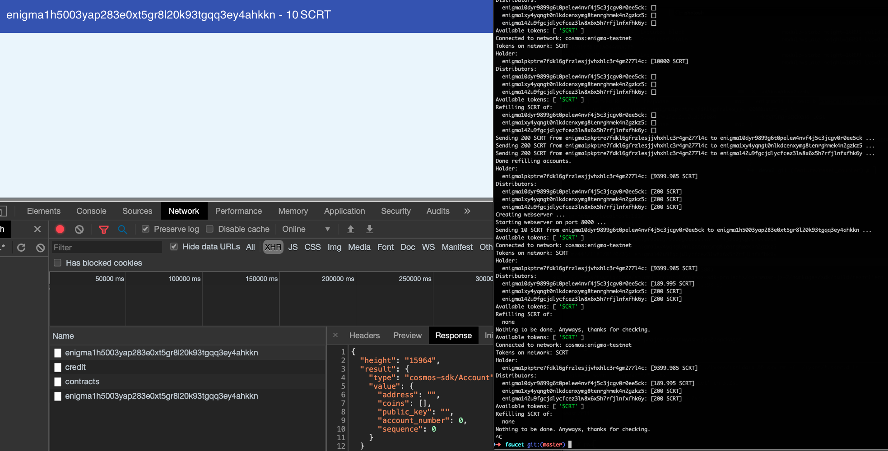
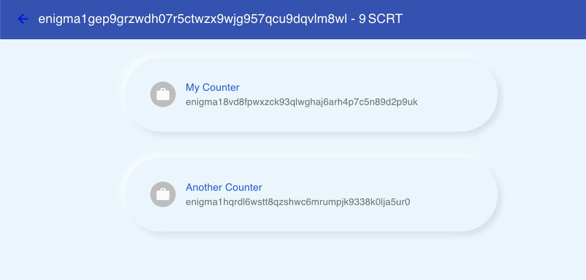
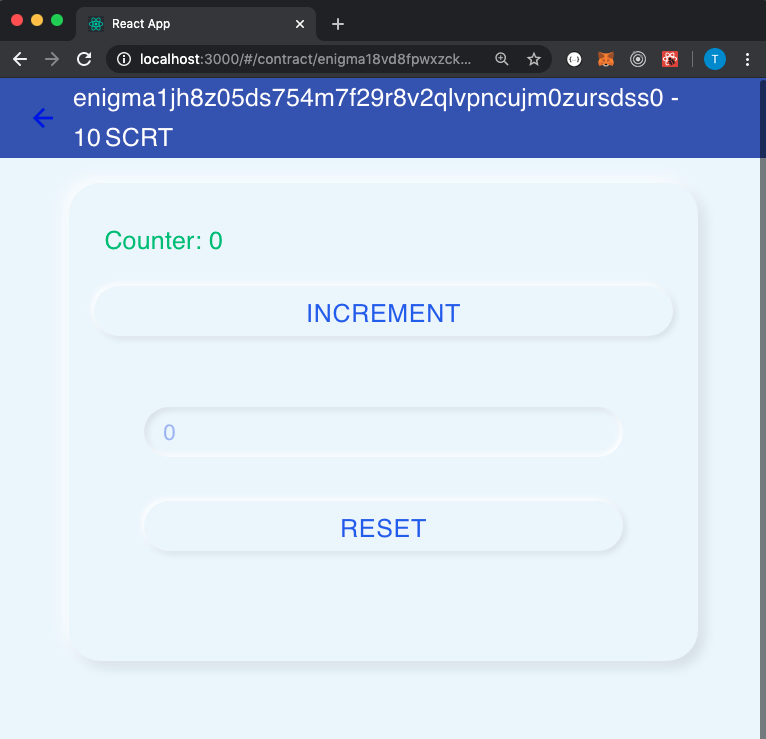
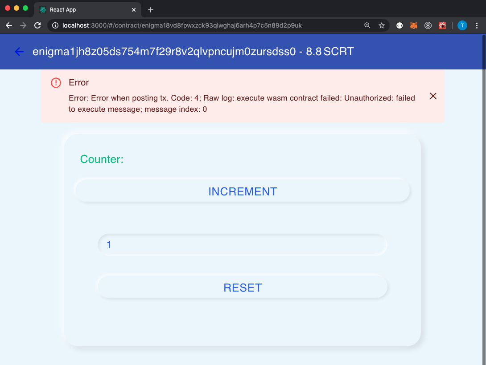

So far we've got a [local Secret Network developer testnet running](README.md), and we've [exposed a rest API to interact with contracts with CosmWasm JS](cosmwasm-js.md).

In this guide we'll build a React application, you can roll your own or clone the [CosmWasm full stack example `name-app`](https://github.com/CosmWasm/name-app) to follow along.

The rest server doesn't enable [Cross-Origin Resource Sharing by default](https://docs.cosmos.network/master/interfaces/rest.html#cross-origin-resource-sharing-cors), and in the current version we can't enable it, so as Cosmos Network docs suggest, we run a [proxy](https://github.com/levackt/devx2/blob/cb9b9206a77f9deed4f16f7b4d5a614cb38c392d/docker-compose.yaml#L17) to handle requests from our application.

NB the example [proxy configuration](https://github.com/levackt/devx2/blob/cb9b9206a77f9deed4f16f7b4d5a614cb38c392d/config/nginx.conf#L38) is not suitable for production use.

The proxy also comes in handy for a faucet, to automatically fund users' accounts.

# Connect with a burner-wallet

Previously we loaded the mnemonic from file, this time the "burner wallet" is kept in the browser's local storage.

[Source](https://github.com/CosmWasm/name-app/blob/a0e2dd78625584f929fdedf964256931a3474616/src/service/sdk.ts#L18)
```ts
// generateMnemonic will give you a fresh mnemonic
// it is up to the app to store this somewhere
export function generateMnemonic(): string {
  return Bip39.encode(Random.getBytes(16)).toString();
}

export function loadOrCreateMnemonic(): string {
  const key = "burner-wallet";
  const loaded = localStorage.getItem(key);
  if (loaded) {
    return loaded;
  }
  const generated = generateMnemonic();
  localStorage.setItem(key, generated);
  return generated;
}

export async function burnerWallet(): Promise<Wallet> {
  const mnemonic = loadOrCreateMnemonic();
  const pen = await Secp256k1Pen.fromMnemonic(mnemonic);
  const pubkey = encodeSecp256k1Pubkey(pen.pubkey);
  const address = pubkeyToAddress(pubkey, "secret");
  const signer = (signBytes: Uint8Array): Promise<StdSignature> => pen.sign(signBytes);
  return { address, signer };
}
```

[Source](https://github.com/CosmWasm/name-app/blob/a0e2dd78625584f929fdedf964256931a3474616/src/service/wallet.tsx#L39)

```tsx

export function BurnerWalletProvider(props: WalletProviderProps): JSX.Element {
  return (
    <SdkProvider config={props.config} loadWallet={burnerWallet}>
      {props.children}
    </SdkProvider>
  );
}
```

# Connect to the server

Reading contract state is free so if our user only needs to know the current count, we can connect using the CosmWasmClient, and not need a wallet.

We want to increment the counter, so we need the SigningCosmWasmClient, note that fees are in uscrt.

```ts
export async function connect(httpUrl: string, { address, signer }: Wallet): Promise<ConnectResult> {
  const client = new SigningCosmWasmClient(httpUrl, address, signer,
    buildFeeTable("uscrt", 1));
  return { address, client };
}
```

A [wallet service](https://github.com/CosmWasm/name-app/blob/master/src/service/wallet.tsx) can use this connection to load or create the wallet, and tap into the faucet if the account is empty.

```ts
  // just call this once on startup
  useEffect(() => {
    loadWallet()
      .then(wallet => connect(config.httpUrl, wallet))
      .then(async ({ address, client }) => {
        // load from faucet if needed
        if (config.faucetUrl) {
          try {
            const acct = await client.getAccount();
            if (!acct?.balance?.length) {
              await ky.post(config.faucetUrl, { json: { ticker: "SCRT", address } });
            }
          } catch(error) {
            console.error(error)
          }
        }

        setValue({
          loading: false,
          address: address,
          getClient: () => client,
        });
      })
      .catch(setError);
```

In the browser's network tab we can see this play out, the account is queried but has no funds initially, then the faucet is hit, `/credit`



With this connection in hand we can now focus on the [contract logic](https://github.com/CosmWasm/name-app/blob/master/src/components/ContractLogic/index.tsx), starting with a list of all the instances of the Counter contract.

```ts
  // get the contracts
  React.useEffect(() => {
    getClient()
      .getContracts(defaultCodeId)
      .then(contracts => setContracts(contracts))
      .catch(setError);
  }, [getClient, setError]);

  return (
    <List>
      {contracts.map(props => (
        <ContractItem {...props} key={props.address} />
      ))}
    </List>
  );

```



Selecting an instance [queries it's current count](https://github.com/levackt/devx2/blob/cb9b9206a77f9deed4f16f7b4d5a614cb38c392d/client/src/components/ContractLogic/Counter.tsx#L42)

```ts
// get_count maps to our contract's QueryMsg GetCount
    getClient()
      .queryContractSmart(contractAddress, { get_count: { } })
      .then(res => {
        const o = parseQueryJson<QueryResponse>(res);
        setState({ count: o.count, loading: false });
      }));
```

[Incrementing the count](https://github.com/levackt/devx2/blob/cb9b9206a77f9deed4f16f7b4d5a614cb38c392d/client/src/components/ContractLogic/Counter.tsx#L55) requires executing the `increment` message on the contract.

```ts
// increment maps to our contract's HandleMsg Increment
    await getClient().execute(
        props.contractAddress,
        {
            increment: { } },
        );
    setState({ loading: false });

    // refresh the account balance
    refreshAccount();

    // query the counter and update the state
    await getClient().queryContractSmart(contractAddress, { get_count: { } })
    .then(res => {
        const o = parseQueryJson<QueryResponse>(res);
        setState({ count: o.count, loading: false });
    })
```

The Counter contract also handles reset messages, which accept a new count value, which we may implement as follows.

Reset requires an integer, so first we [validate the input](https://github.com/levackt/devx2/blob/master/client/src/components/Form/validationSchema.ts) to avoid contract failures, improving the UX and saving gas.

```ts
export const ResetValidationSchema = Yup.object().shape({
  countField: Yup.number()
    .min(0, "Count invalid")
    .required("Count is required"),
});

```

We can then [Create a Form](https://github.com/levackt/devx2/blob/master/client/src/components/ContractLogic/ResetForm.tsx) using Formik for example, which keeps track of values/errors/visited fields, orchestrating validation, and handling submission.

```html
    <Formik
      initialValues={{
        countField: "0",
      }}
      validationSchema={ResetValidationSchema}
      onSubmit={async ({ countField }, { setSubmitting }) => {
        setSubmitting(true);
        handleReset({ countField });
      }}
    >
      {({ handleSubmit }) => (
        <Form onSubmit={handleSubmit} className={classes.form}>
          <div className={classes.input}>
            <FormTextField placeholder="0" name={COUNT_FIELD} type="integer" />
          </div>
          <div>
            <Button type="submit" disabled={loading}>
              Reset
            </Button>
          </div>
        </Form>
      )}
    </Formik>
```

Add the ResetForm to [the Counter component](https://github.com/levackt/devx2/blob/cb9b9206a77f9deed4f16f7b4d5a614cb38c392d/client/src/components/ContractLogic/Counter.tsx#L114)
```html
    <ResetForm handleReset={reset} loading={state.loading} />
```



All that's left is to [execute the reset](https://github.com/levackt/devx2/blob/cb9b9206a77f9deed4f16f7b4d5a614cb38c392d/client/src/components/ContractLogic/Counter.tsx#L85) when the user submits.

```ts

  const reset = async (values: FormValues): Promise<void> => {
    const newCount = values[COUNT_FIELD];
    setState({ loading: true });
    try {
      await getClient().execute(
        props.contractAddress,
        { reset: { count: parseInt(newCount) } }
      );
      setState({ count: newCount, loading: false });
    } catch (err) {
      setState({ loading: false });
      setError(err);
    }
    try {
      refreshAccount();
    } catch(err) {
      setError("Failed to reset account");
    }
  };

```

Because we're using the burner wallet, the user won't be authorized to reset, the contract ensures [only the contract owner](https://github.com/levackt/devx2/blob/cb9b9206a77f9deed4f16f7b4d5a614cb38c392d/src/contract.rs#L52) can execute that. 

We could query the contract owner and only show the ResetForm if the current account is the contract owner.

```rust
    if env.message.signer != state.owner {
        Unauthorized {}.fail()?;
    }
```




# Resources
- [Full Stack CosmWasm](https://medium.com/confio/full-stack-cosmwasm-12fb3ae5cd5a)
